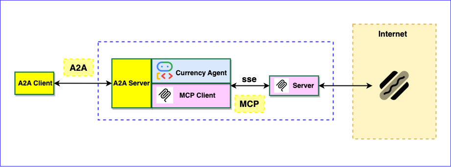

# 💵💱💶 Currency Agent (A2A + ADK + MCP)

[![Open In Codelab][codelab-badge]][codelab]
[](https://www.python.org/)
[![Framework](https://img.shields.io/badge/Framework-ADK-4285F4.svg?logo=data:image/png;base64,iVBORw0KGgoAAAANSUhEUgAAAA4AAAAOCAYAAAAfSC3RAAAABGdBTUEAALGPC/xhBQAAACBjSFJNAAB6JgAAgIQAAPoAAACA6AAAdTAAAOpgAAA6mAAAF3CculE8AAAAhGVYSWZNTQAqAAAACAAFARIAAwAAAAEAAQAAARoABQAAAAEAAABKARsABQAAAAEAAABSASgAAwAAAAEAAgAAh2kABAAAAAEAAABaAAAAAAAAAEgAAAABAAAASAAAAAEAA6ABAAMAAAABAAEAAKACAAQAAAABAAAADqADAAQAAAABAAAADgAAAABOylT5AAAACXBIWXMAAAsTAAALEwEAmpwYAAABWWlUWHRYTUw6Y29tLmFkb2JlLnhtcAAAAAAAPHg6eG1wbWV0YSB4bWxuczp4PSJhZG9iZTpuczptZXRhLyIgeDp4bXB0az0iWE1QIENvcmUgNi4wLjAiPgogICA8cmRmOlJERiB4bWxuczpyZGY9Imh0dHA6Ly93d3cudzMub3JnLzE5OTkvMDIvMjItcmRmLXN5bnRheC1ucyMiPgogICAgICA8cmRmOkRlc2NyaXB0aW9uIHJkZjphYm91dD0iIgogICAgICAgICAgICB4bWxuczp0aWZmPSJodHRwOi8vbnMuYWRvYmUuY29tL3RpZmYvMS4wLyI+CiAgICAgICAgIDx0aWZmOk9yaWVudGF0aW9uPjE8L3RpZmY6T3JpZW50YXRpb24+CiAgICAgIDwvcmRmOkRlc2NyaXB0aW9uPgogICA8L3JkZjpSREY+CjwveDp4bXBtZXRhPgoZXuEHAAACRUlEQVQoFXVSS2gTQRj+Z3aziUlF1ISkRqqpVpCaixgkkEOaUGktBopuRQXxKF68pIdCpSsYH4gWxINHT8ZmVUR7MaRND4pUFBFfB7GXqt1iAlGS5rn7O7NpFg/6HeZ/zPfN/PMxAOtQFKSd/L8RFYtDOEmWUVBVovM8fgHDDc+iv+I9VxcgAAhdEtUbP16dTL80uRlZUMdUnXREPBb3/7pDm65g1f3iS9094QRjOwBZWwO09REQ3++kD86qY6DLTAydEWOXy8lYqpzjp/4LB+4fzYVmjiXNPTYyVRRi8IIgRijqk4eua65YqnJLzqDA+wPXijdOALpbzocTaHRFeA+IYliPZaVGCD2cHfdVCJRT6lj7zS1dupoGUhCrsREgVc0Ucm1UQXFBIa3IlVJvU5ceiQTmNyPmddR9DbAZur28Wt1xJi4YjiFq2Eeen7q3FM1HGY2DGQPM1dM3C/5izZ6sGdA9Jzm1YAOc2xzfNj3bNfUJ9t2dhj74DRkQgBlk6vhSy+49b8zBG1wBD69xD4wiQI+Zg/dIHUL97Twq8mi9UaSfo03snSXd8HMlkbitBYbGPxyftHHS99HdW0qDkC4MhOIEFlqoALWEhuGoEVia5UQbLCdoffVdcObSV15v1EpPmfdbkWDbVdazhJQ2KwSlx7gIAfeTtz1EEv3F+MFBLqw7nVNIYNoz//oiG5+Cwj4UIpgGYR58tayQwJzLy8kcODxs53E5HN7AI4fy12WW2Nxhy0e5X+rk7Ia286yBMvtq6/gDb7bjW6TkRnEAAAAASUVORK5CYII=)](https://github.com/google/adk-python)
[](LICENSE)

[codelab-badge]: https://img.shields.io/badge/Open%20In%20Codelab-blue?labelColor=grey&style=flat&logo=data:image/png;base64,iVBORw0KGgoAAAANSUhEUgAAACAAAAAgCAMAAABEpIrGAAAAyVBMVEX////////////////////////+8/L0oZrrTkHqQzXzlY13yKEPnVgdo2KHzqvw+fX4xMDtWk604MssqWz73NnvcWdKtYHS7eD85+ZowpayncOWapvVS0360MzD5tWW1LZxo/dChfSLaKHfR0FMhe2rY4TyiYBlm/bQ4Pz+7sD7xCPPthRJpkegwvl9q/fn8P7+9+D80VL7vASisCQsoU4spV393YHPwDm40ftNjPX7wBP95qHz9/7/++/b6P3+8tD8zUKIsvj81WJbutStAAAABnRSTlMAIKDw/zDiNY+eAAAA+klEQVR4AbzRRYICMRRF0VB5QLlrO+7uDvvfVKfSv91mnGlunDFWUDh+xJUCE4ocv+JFMZ/jD7zAFPxJYRx/4gz/uGpQKquaDsEwLdv5HrieJriAbwqB/yUII00qA7YpxcmHoKRrJAUSk2QOKLi5vdMk7x7CQ0CF9fgSPFUqlWpN09QyiG1REsugkqs3miW8cTIqHApyrTbedLq9vgzkCoMKGY4gjSdTYTY3F74M0G5VyADCckpWnbd3WG+oaAMdGt7uPj7UfvC2BC2wPIACMspvuzkCp60YPo9/+M328LKHcHiek6EmnRMMAUAw2RPMOASzHsHMSzD7AwCdmyeTDUqFKQAAAABJRU5ErkJggg==
[codelab]: https://codelabs.developers.google.com/codelabs/currency-agent

A sample agent demonstrating A2A + ADK + MCP + A2UI working together. It leverages the new **Agent2Agent (A2A) Python SDK** ([`a2a-sdk`](https://github.com/google-a2a/a2a-python)), Google's **Agent Development Kit (ADK)** ([`google-adk`](https://github.com/google/adk-python) v2.1.0+), and the **Agent-to-User Interface (A2UI) SDK** (`a2ui-agent-sdk`).

Both A2A and ADK were [announced at Google I/O 2025](https://developers.googleblog.com/en/agents-adk-agent-engine-a2a-enhancements-google-io/).



## Overview

The sample aims at laying out a foundation and showcasing the capabilities
of A2A + ADK + MCP. It is a currency converter agent that can convert between different
countries' currencies.

###  Model Context Protocol (MCP)

> MCP is an open protocol that standardizes how applications provide context to LLMs. Think of MCP like a USB-C port for AI applications. Just as USB-C provides a standardized way to connect your devices to various peripherals and accessories, MCP provides a standardized way to connect AI models to different data sources and tools. - [Anthropic](https://modelcontextprotocol.io/introduction)

The MCP server in this example exposes a tool `get_exchange_rate` that can be used to get the exchange rate between two currencies such as USD and EUR. It leverages the [Frankfurter](https://www.frankfurter.dev/) API to get the currency exchange rate. Our agent uses an MCP client to invoke this tool when needed.

###  Agent Development Kit (ADK)

> ADK is a flexible and modular framework for developing and deploying AI agents. While optimized for Gemini and the Google ecosystem, ADK is model-agnostic, deployment-agnostic, and is built for compatibility with other frameworks. - [ADK](https://github.com/google/adk-python)

ADK (v2.1.0+) is used as the orchestration framework for creating our currency agent in this sample. It handles the conversation with the user and invokes our MCP tool when needed.

###  Agent2Agent (A2A)

> Agent2Agent (A2A) protocol addresses a critical challenge in the AI landscape: enabling gen AI agents, built on diverse frameworks by different companies running on separate servers, to communicate and collaborate effectively - as agents, not just as tools. A2A aims to provide a common language for agents, fostering a more interconnected, powerful, and innovative AI ecosystem. - [A2A](https://github.com/a2aproject/A2A)

The new [A2A Python SDK](https://github.com/google-a2a/a2a-python) is used to create an A2A server that advertises and executes our ADK agent. We then run an A2A client that connects to our A2A server and invokes our ADK agent.

### 🎨 Agent-to-User Interface (A2UI)

> Agent-to-User Interface (A2UI) standardizes how agents supply layout, presentation, and interactive widgets back to the user-facing web application. Rather than outputting plain text or markdown tables, A2UI defines structured component JSON structures (like Cards, Tables, Columns, Rows, and Charts) that the web frontend can parse and render as highly polished, interactive UI cards.

Our agent leverages the `a2ui-agent-sdk` library (configured via `A2uiSchemaManager`, `BasicCatalog`, `SendA2uiToClientToolset`, and `A2uiPartConverter`) to instruct the LLM on catalog components and convert generated layout descriptions. The user's web browser automatically interprets the returned `<a2ui-json>` elements and renders them dynamically. 

## Getting Started

### Prerequisites

- Python 3.13+
- Git, for cloning the repository.
- Node.js & npm (for building the frontend web applications).

### Installation

1. Clone the repository:

```bash
git clone https://github.com/jackwotherspoon/currency-agent.git
cd currency-agent
```

2. Install [uv](https://docs.astral.sh/uv/getting-started/installation) (used to manage dependencies):

```bash
# macOS and Linux
curl -LsSf https://astral.sh/uv/install.sh | sh

# Windows (uncomment below line)
# powershell -ExecutionPolicy ByPass -c "irm https://astral.sh/uv/install.ps1 | iex"
```

> [!NOTE]
> You may need to restart or open a new terminal after installing `uv`.

3. Configure environment variables (via `.env` file):

There are two different ways to call Gemini models:

- Calling the Gemini API directly using an API key created via Google AI Studio.
- Calling Gemini models through Vertex AI APIs on Google Cloud.

> [!TIP] 
> An API key from Google AI Studio is the quickest way to get started.
> 
> Existing Google Cloud users may want to use Vertex AI.

<details open>
<summary>Gemini API Key</summary> 

Get an API Key from Google AI Studio: https://aistudio.google.com/apikey

Create a `.env` file by running the following (replace `<your_api_key_here>` with your API key):

```sh
echo "GOOGLE_API_KEY=<your_api_key_here>" >> .env \
&& echo "GOOGLE_GENAI_USE_VERTEXAI=FALSE" >> .env
```

</details>

<details>
<summary>Vertex AI</summary>

To use Vertex AI, you will need to [create a Google Cloud project](https://developers.google.com/workspace/guides/create-project) and [enable Vertex AI](https://cloud.google.com/vertex-ai/docs/start/cloud-environment).

Authenticate and enable Vertex AI API:

```bash
gcloud auth login
# Replace <your_project_id> with your project ID
gcloud config set project <your_project_id>
gcloud services enable aiplatform.googleapis.com
```

Create a `.env` file by running the following (replace `<your_project_id>` with your project ID):
```sh
echo "GOOGLE_GENAI_USE_VERTEXAI=TRUE" >> .env \
&& echo "GOOGLE_CLOUD_PROJECT=<your_project_id>" >> .env \
&& echo "GOOGLE_CLOUD_LOCATION=us-central1" >> .env
```

</details>

Now you are ready for the fun to begin!

## Local Deployment

You can manage all services using the provided `Makefile`.

### Start all services

To start the MCP Server and the A2A Agent in the background:

```bash
make start
```

This will redirect output to `mcp.log` and `agent.log`.

### Check status

To see if the services are running:

```bash
make status
```

### Stop all services

To stop the background processes:

```bash
make stop
```

### Manual/Foreground Execution

If you prefer to run services in separate terminals (foreground):

**MCP Server:**
```bash
make mcp
# or: uv run mcp-server/server.py
```

**A2A Server:**
```bash
make agent
# or: uv run uvicorn currency_agent.agent:a2a_app --host 127.0.0.1 --port 10000
```

### Frontend Applications

You can run two different frontend applications to interface with the currency agent:

#### 1. FastAPI + Vanilla TypeScript Frontend (with A2UI Demo Sandbox)
This frontend renders dynamic, glassmorphic UI components directly from the agent's A2UI responses. It also contains two sandbox launcher buttons to demo the rendering pipeline instantly.

- **Install dependencies:**
  ```bash
  make frontend-install
  ```
- **Build frontend code:**
  ```bash
  make frontend-build
  ```
- **Start frontend server:**
  ```bash
  make frontend
  ```
- **Access UI:** Open `http://localhost:8000` in your web browser.

#### 2. React + CopilotKit Frontend
An alternative, modern React UI featuring CopilotKit integration for agent-supported user interactions.

- **Install dependencies:**
  ```bash
  make react-install
  ```
- **Start the React UI Dev Server:**
  ```bash
  make react-ui
  ```
  This opens the web portal on `http://localhost:3000`.
- **Start the React Agent Service:**
  ```bash
  make react-agent
  ```
  This launches the FastAPI/Uvicorn backend handler at `http://localhost:8000`.

### A2A Client (CLI Test tool)

Once the servers are running, you can run command-line test queries against the A2A agent:

```bash
make test-client
# or: uv run currency_agent/test_client.py
```

## 🤝 Contributing

Contributions are welcome! Please feel free to submit pull requests or open issues.

## 📄 License

This project is licensed under the Apache 2.0 License - see the [LICENSE file](LICENSE) for details.
