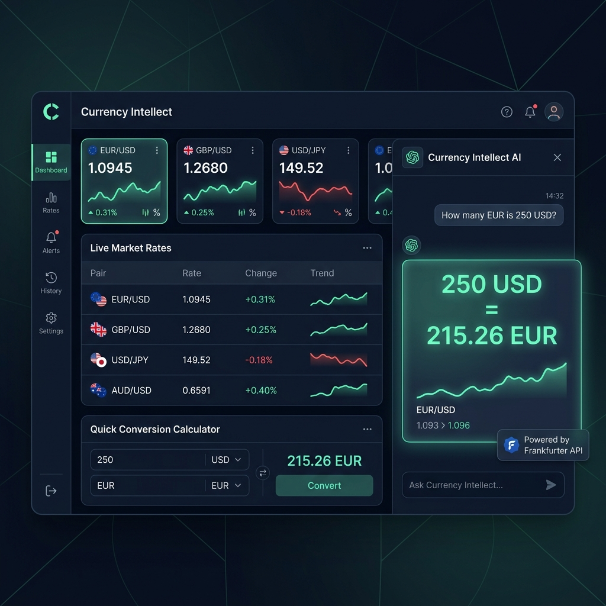

# Currency Intellect — A2UI Interface Mockup & Demo Sandbox

We have designed a premium visual mockup of the A2UI interface and built a functional, interactive **A2UI Demo Sandbox** directly inside the workspace frontend.

## 🎨 Visual Mockup

Below is the designed interface for the **Currency Intellect** workspace. It shows a deep-dark theme with electric mint green and high-tech blue highlights, featuring glassmorphic A2UI response cards in the chatbot history and a comprehensive dashboard on the left.



---

## 🛠️ Interactive Demo Sandbox

To see these exact A2UI cards render live in the actual web workspace without needing an active model call or API server, you can use the newly added sandbox buttons.

### Key Additions
1. **Frontend HTML Sandbox**:
   Added a new section **A2UI Demo Sandbox** to [index.html](file:///home/xbill/currency-agent/frontend/frontend/index.html) with two mockup launcher buttons:
   - **Demo 1: A2UI Conversion Card**
   - **Demo 2: A2UI Rates Table**

2. **Sandbox Interaction Handlers**:
   Added event listeners in [app.ts](file:///home/xbill/currency-agent/frontend/frontend/app.ts) that inject simulated user requests and complete `<a2ui-json>` agent responses into the chat window. The workspace UI automatically parses and renders these responses using its native `renderA2UI` system.

### How to run the Demo
1. Run the frontend build:
   ```bash
   make frontend-build
   ```
2. Start the frontend server:
   ```bash
   make frontend
   ```
3. Open your browser to `http://localhost:8000`.
4. Click on **Demo 1: A2UI Conversion Card** or **Demo 2: A2UI Rates Table** on the welcome screen to view the live mockup rendering.
