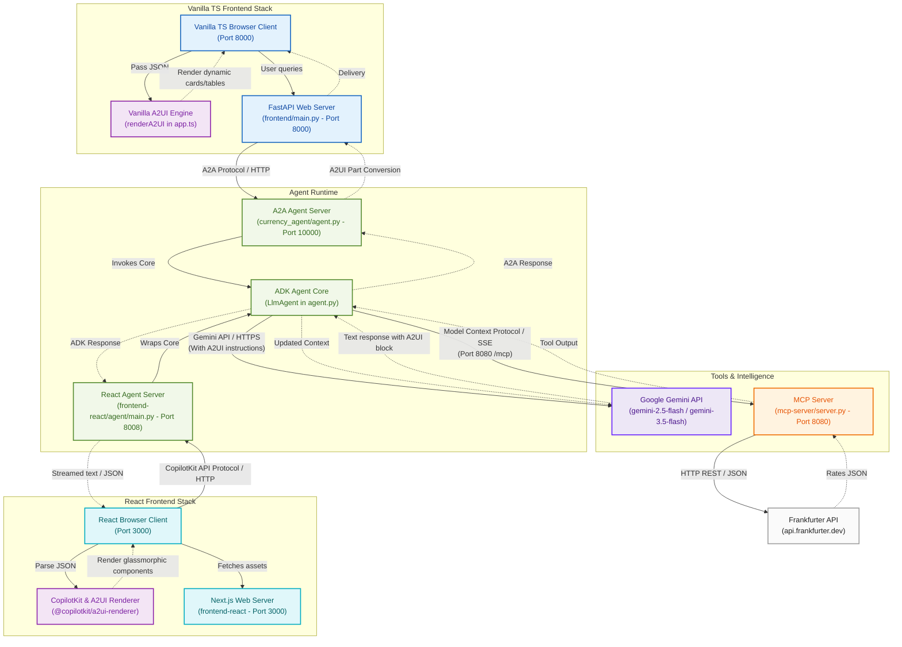

# Currency Agent Architecture & Protocols (Vanilla TS & React + CopilotKit)

Below is a visual flow of interactions between the user-facing workspace frontends, the agent wrappers, the Gemini LLM, the local Model Context Protocol (MCP) server, and the external data source:

## Architecture Diagram (Mermaid)

Below is the Mermaid flowchart representation of the architecture:

---

## Detailed Components & Protocols

### 1. Agent-to-Agent (A2A) Protocol (Vanilla TS Stack)
*   **Source:** [main.py](file:///home/xbill/currency-agent-agui/frontend/main.py)
*   **Destination:** [agent.py](file:///home/xbill/currency-agent-agui/currency_agent/agent.py)
*   **Port:** Default `10000` (or `8080` in Cloud Run env)
*   **Protocol Details:** 
    *   Uses the **A2A Python SDK** (`a2a-sdk`).
    *   Uses standard HTTP endpoints to register, exchange, and resolve agent metadata cards.
    *   Implements `SendMessageRequest`, asynchronous task generation (`Task` object), and status polling (`GetTaskRequest`).
    *   Enables multi-turn conversational context (`contextId` propagation).

### 2. CopilotKit & React Integration (React Stack)
*   **Source:** [page.tsx](file:///home/xbill/currency-agent-agui/frontend-react/src/app/page.tsx)
*   **Destination:** [main.py](file:///home/xbill/currency-agent-agui/frontend-react/agent/main.py)
*   **Port:** Default `8008` (for the Agent API)
*   **Protocol Details:**
    *   Uses the **CopilotKit React SDK** (`@copilotkit/react-core/v2`) and the `@copilotkit/a2ui-renderer` wrapper.
    *   Establishes a WebSocket or server-sent streaming connection to stream agent thoughts, text, and structure.
    *   The ADK Middleware agent is served on Port 8008 via FastAPI and wrapped in `ADKAgent` to translate ADK streaming chunks to CopilotKit-compatible events.

### 3. Google Gemini API Protocol
*   **Source:** [agent.py](file:///home/xbill/currency-agent-agui/currency_agent/agent.py) (via Google ADK `LlmAgent` in the shared agent core)
*   **Destination:** Google GenAI Gemini endpoint (or Vertex AI APIs)
*   **Protocol Details:**
    *   Secured via `GOOGLE_API_KEY` (Gemini API) or Google Cloud Service Account credentials (Vertex AI).
    *   Uses standard HTTPS JSON payloads.
    *   Communicates model instructions, user prompts, conversation history, and handles function/tool-calling schemas returned by the model.
    *   The primary model used is `gemini-3.5-flash` or `gemini-2.5-flash` (with `gemini-2.5-pro` as a reasoning alternative).

### 4. Model Context Protocol (MCP)
*   **Source:** [agent.py](file:///home/xbill/currency-agent-agui/currency_agent/agent.py) (via `McpToolset` / `StreamableHTTPConnectionParams`)
*   **Destination:** [server.py](file:///home/xbill/currency-agent-agui/mcp-server/server.py)
*   **Port:** Default `8080` (endpoint `/mcp`)
*   **Protocol Details:**
    *   Standardizes tool exposure and execution schema under the **Model Context Protocol** spec.
    *   Communicates over HTTP using Server-Sent Events (SSE) or simple HTTP SSE streams.
    *   The MCP Server advertises the available tool (`get_exchange_rate`) and receives tool execution requests containing parameters (e.g. `currency_from`, `currency_to`, `currency_date`).

### 5. HTTP REST/JSON API Protocol
*   **Source:** [server.py](file:///home/xbill/currency-agent-agui/mcp-server/server.py)
*   **Destination:** Frankfurter API (`https://api.frankfurter.dev`)
*   **Protocol Details:**
    *   Standard HTTP GET request using `httpx`.
    *   Fetches real-time market data in standard JSON format containing exchange rates.

### 6. Agent-to-UI (A2UI) Protocol & Integration
*   **Source:** `a2ui` package & [agent.py](file:///home/xbill/currency-agent-agui/currency_agent/agent.py) (via `SendA2uiToClientToolset`, `A2uiPartConverter`)
*   **Destination:** [app.ts](file:///home/xbill/currency-agent-agui/frontend/frontend/app.ts) (Vanilla TS) or [page.tsx](file:///home/xbill/currency-agent-agui/frontend-react/src/app/page.tsx) (React)
*   **Protocol Details:**
    *   Defines standard JSON schemas for rich, interactive, and responsive UI components (e.g. Cards, Tables, Text fields, Columns, Rows, and Charts).
    *   The `A2uiSchemaManager` generates system prompt instructions, catalogs, and examples instructing the LLM on component schemas.
    *   The LLM generates structured layout descriptions wrapped in `<a2ui-json>` elements.
    *   **Vanilla TS**: The frontend client parses responses via regex for `<a2ui-json>...</a2ui-json>`, then uses the `renderA2UI()` engine to map JSON components directly to glassmorphic, stylized HTML container elements.
    *   **React**: The Next.js frontend client uses the `useA2UI()` hook and `A2UIRenderer` component to automatically process messages and dynamically render state-driven, beautifully themed React UI elements.
